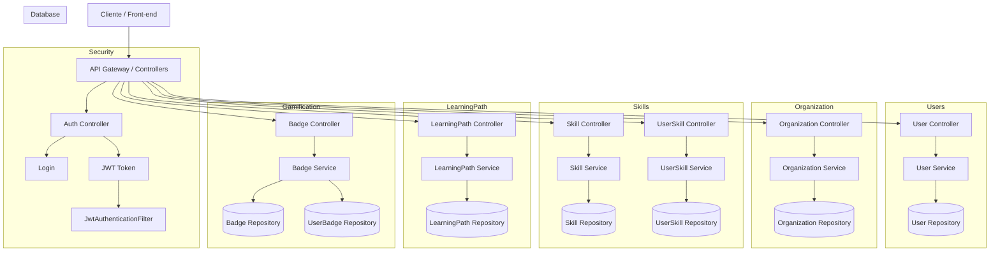

# Reframe – Plataforma Inteligente de Upskilling & Reskilling com IA

Reframe é uma plataforma desenvolvida para auxiliar profissionais e organizações a navegar pelas demandas do futuro do trabalho. A aplicação realiza mapeamento de habilidades, identifica lacunas, gera trilhas de aprendizagem personalizadas com IA e aplica gamificação para engajar e acompanhar o progresso.

Este projeto foi desenvolvido como parte da Global Solution FIAP, seguindo os requisitos de Arquitetura de Software, Web Services, Segurança e Boas Práticas de Código.

---

##  O foco do projeto

O Reframe tem como proposta:

* Mapear habilidades atuais de profissionais.
* Comparar essas habilidades com competências emergentes do mercado.
* Gerar automaticamente trilhas de aprendizado (Learning Tracks) personalizadas.
* Aplicar gamificação com badges, XP e níveis.
* Permitir que empresas visualizem mobilidade interna e potenciais carreiras futuras.
* Disponibilizar APIs seguras (JWT + RBAC + Stateless Sessions).

---

##  Arquitetura do Sistema

O sistema segue arquitetura modular baseada em serviços independentes, dentro de um único projeto Spring Boot.

### Estrutura de Módulos

```
com.reframe
 ├── config (segurança, JWT, filtros)
 ├── controller (exposição de endpoints HTTP)
 ├── modules
 │    ├── organization (gestão de organizações)
 │    ├── user (gestão de usuários, autenticação)
 │    ├── skill (skills do mercado)
 │    ├── userSkill (skills individuais por usuário)
 │    ├── learningPath (trilhas automáticas)
 │    ├── badge (gamificação, XP, conquistas)
 │    └── ...
 └── security (JWT, UserDetails, filtros)
```

---

### Spring Security + JWT

* Login com email e senha.
* Geração de JWT com chave de 256 bits.
* Filtro de autenticação `JwtAuthenticationFilter`.
* Política **STATELESS** para todas as sessões.
* Autorização baseada em roles (`ADMIN`, `ORG_ADMIN`, `USER`).

---

##  Tecnologias Utilizadas

* **Java 21**
* **Spring Boot 3**
* Spring Web
* Spring Security
* Spring Data JPA
* MySQL 8
* JWT (jjwt)
* Maven

---

##  Como Rodar o Projeto

### 1. Instalar dependências

Certifique-se de ter instalado:

* Java 21 ou superior
* Maven
* MySQL

### 2. Criar o banco de dados

```sql
CREATE DATABASE reframe_db;
```

### 3. Configurar o `application.properties`

```
spring.datasource.url=jdbc:mysql://localhost:3306/reframe_db?useSSL=false&serverTimezone=UTC
spring.datasource.username=root
spring.datasource.password=SUASENHA
spring.jpa.hibernate.ddl-auto=update
spring.jpa.show-sql=true
```

### 4. Rodar a aplicação

```
mvn spring-boot:run
```


##  Endpoints Principais (Resumo)

###  Auth

| Método | Endpoint          | Descrição         |
| ------ | ----------------- | ----------------- |
| POST   | `/api/auth/login` | Retorna token JWT |

---

###  User's

| Método | Endpoint          | Descrição                         |
| ------ | ----------------- | --------------------------------- |
| POST   | `/api/users`      | Criar usuário (público)           |
| GET    | `/api/users`      | Listar usuários (ADMIN/ORG_ADMIN) |
| GET    | `/api/users/{id}` | Buscar usuário                    |

---

###  Organizações

| Método | Endpoint             |
| ------ | -------------------- |
| POST   | `/api/organizations` |
| GET    | `/api/organizations` |

---

###  Skills & Perfil do Usuário

| Método | Endpoint                     |
| ------ | ---------------------------- |
| POST   | `/api/skills`                |
| GET    | `/api/skills`                |
| POST   | `/api/user-skills`           |
| GET    | `/api/user-skills/user/{id}` |

---

###  Learning Path

| Método | Endpoint                               |
| ------ | -------------------------------------- |
| POST   | `/api/learning-path/generate/{userId}` |
| GET    | `/api/learning-path/{userId}`          |

---

###  Gamificação

| Método | Endpoint                                          | Descrição                |
| ------ | ------------------------------------------------- | ------------------------ |
| POST   | `/api/badges`                                     | Criar badge (ADMIN)      |
| POST   | `/api/badges/award/user/{userId}/badge/{badgeId}` | Conceder badge           |
| GET    | `/api/badges/user/{userId}`                       | Listar badges do usuário |

---

##  Funcionalidades da aplicação

###  Cadastro e autenticação de usuários (com roles)

###  Gestão de organizações

###  Registro de skills do mercado

###  Registro de skills por usuário (nível atual)

###  IA Reframe Engine (Trilha automática)

* Seleciona skills com maior relevância/urgência.
* Ordena por prioridade.
* Gera tarefas e recomendações automáticas.

###  Gamificação

* XP por conquista
* Sistema de níveis
* Badges únicos
* Histórico de conquistas


---

##  Licença

Este projeto é acadêmico e destinado exclusivamente para fins educacionais.

---

##  Diagrama da Arquitetura da Aplicação



##  Contato

Dúvidas ou sugestões? Entre em contato pelo GitHub ou e-mail: **[contact.zampieri@gmail.com](mailto:contact.zampieri@gmail.com)**

---

> *"Upskill, Reskill & Reframe your Future."*
